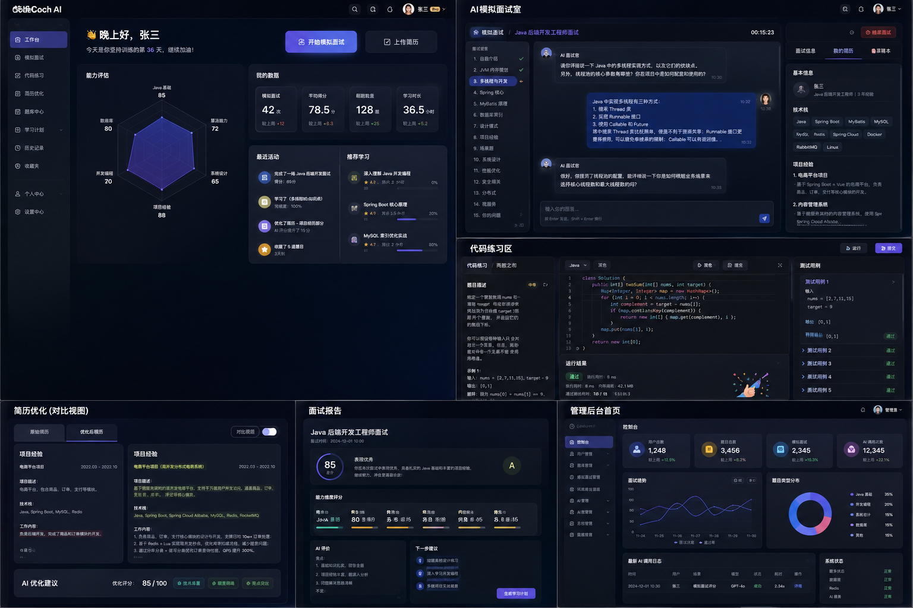
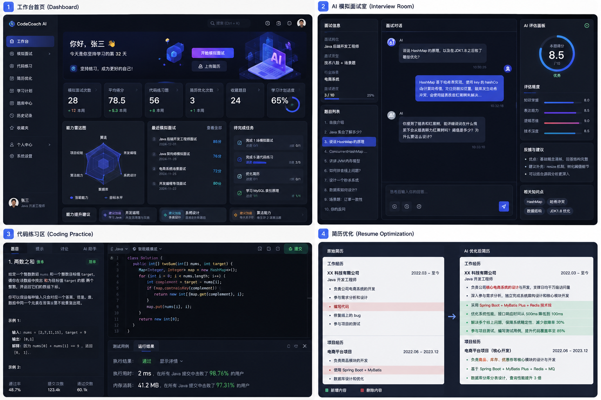
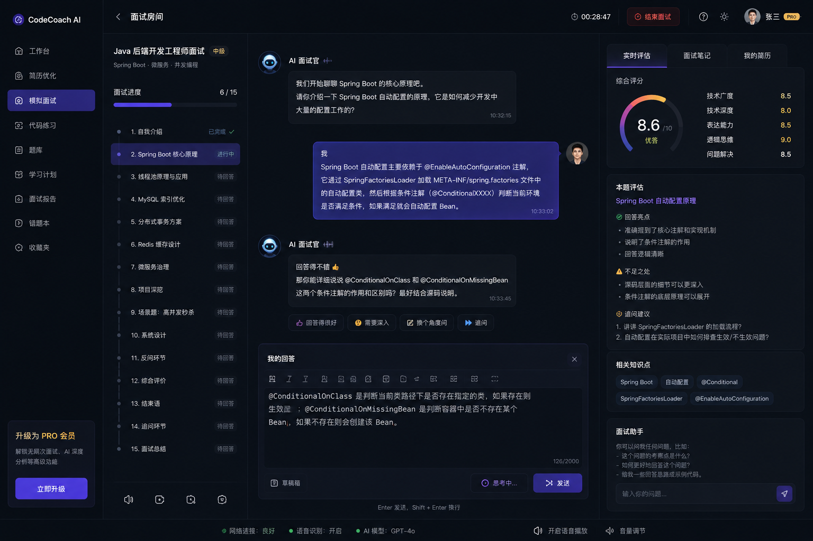
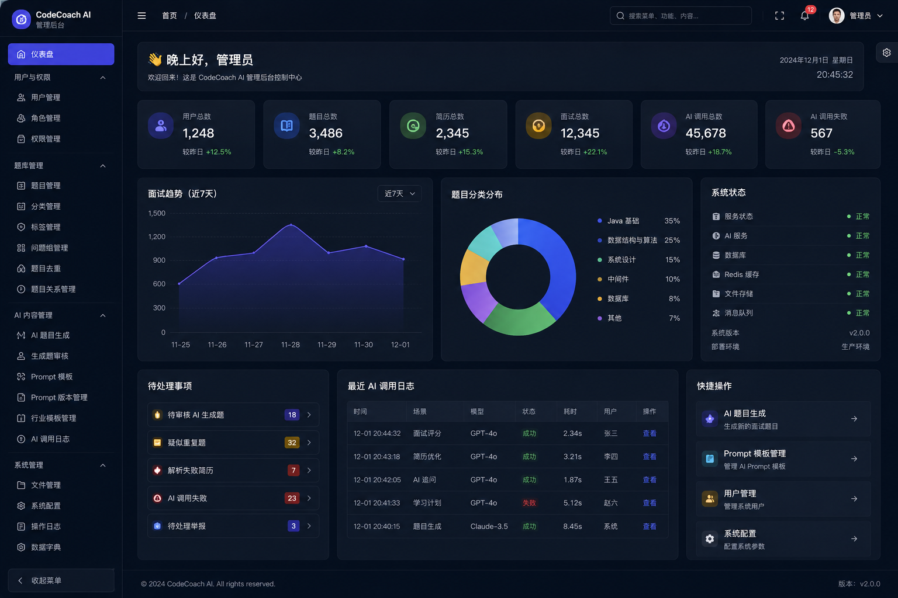

# CodeCoachAI 前端重构 PRD / UI 设计说明：深色 AI 工作台版

> 版本：V1.0  
> 适用仓库：`codecoch-ai-vue`  
> 关联仓库：`codecoch-ai-java` / `codecoch-ai-doc`  
> 文档目的：用于指导 Codex 执行前端视觉重构、页面重排与组件体系优化。

## 0. 视觉参考

> 以下图片仅作为风格参考，不作为像素级设计稿。









## 1. 项目背景与当前状态

CodeCoachAI 是面向 Java 求职者的 AI 面试训练与简历优化平台，包含用户端训练流程、管理端内容治理能力、AI 调用与 Prompt 管理能力。

| 维度 | 当前状态 |
| --- | --- |
| 后端 | 已开发到 V2，处于测试收尾阶段。 |
| 前端 | 已完成 V1，当前主要是 Element Plus 普通后台风格。 |
| 文档 | 独立 codecoch-ai-doc 仓库维护 PRD、状态记录、阶段规划。 |
| 本次目标 | 对前端进行视觉重构与页面体验升级，优先提升用户端 AI 面试体验。 |

### 1.1 当前前端主要问题

- 页面整体偏普通管理后台，AI 产品感、开发者工具感不足。
- 用户端工作台对训练路径、能力成长、AI 价值的表达不够强。
- 面试房间还需要强化为“三栏 AI 面试作战台”，突出对话、进度和实时反馈。
- V2 后端能力逐步成型，前端需要提前预留简历上传、AI 优化、学习计划、行业场景面试等入口。
- 全局样式和组件体系需要统一，避免每个页面单独写样式。

## 2. 重构目标与边界

### 2.1 重构目标

- 将前端从普通后台风格升级为“深色 AI SaaS + 开发者 IDE + AI 面试作战台”风格。
- 保留 V1 已有业务闭环，重点增强用户端工作台、创建面试、面试房间、面试报告、简历中心。
- 管理端保持工程化后台风格，重点突出题库治理、Prompt 管理、AI 调用日志和系统配置。
- 建立统一的主题变量、组件规范和页面布局规范，便于后续 V2/V3 扩展。

### 2.2 重构边界

| 允许做 | 暂不做 |
| --- | --- |
| 调整 Layout、主题、颜色、卡片、图标、页面结构。 | 不重写后端接口、不修改接口路径。 |
| 引入 Tailwind CSS、暗色主题管理、现代图标体系。 | 不全量替换 Element Plus。 |
| 用户端核心页面可以使用 shadcn-vue 风格组件。 | 不在第一轮接入 Monaco Editor。 |
| V2 入口可以预留，但必须标注“待接入”。 | 不伪造后端不存在的数据。 |

## 3. 目标视觉风格

本次前端重构目标风格定义为：**深色 AI SaaS 工作台风格**。更具体地说，是 **Dark Mode + AI Chat Workspace + Developer IDE Dashboard + Glassmorphism** 的组合。

### 3.1 视觉关键词

- 深色背景：深蓝黑 / 深灰黑，营造 AI 工具与 IDE 工作台氛围。
- 蓝紫主色：用于按钮、高亮、选中态、评分、进度条和 AI 反馈面板。
- 卡片化布局：用于指标、训练路径、AI 建议、评分维度、简历信息。
- 玻璃态面板：深色半透明背景 + 细边框 + 轻阴影。
- 三栏工作台：面试房间采用左侧进度、中间对话、右侧评估。
- 开发者工具感：借鉴 IDE、AI Coding 工具、Chat Workspace 的信息组织方式。

## 4. 技术选型与分工

| 类型 | 技术 | 用途 |
| --- | --- | --- |
| 保留 | Vue 3 / Vite / TypeScript | 继续作为前端基础工程体系。 |
| 保留 | Vue Router / Pinia / Axios | 继续承载路由、状态管理和接口请求。 |
| 保留 | Element Plus | 继续用于管理端表格、表单、分页、弹窗、抽屉等复杂后台组件。 |
| 保留 | ECharts | 用于工作台能力图、趋势图、后台统计图。 |
| 新增 P0 | Tailwind CSS | 用于深色主题、卡片、布局、响应式、三栏工作台。 |
| 新增 P0 | @vueuse/core | 用于 dark mode、localStorage、响应式工具。 |
| 新增 P0 | lucide-vue-next | 用于现代线性图标体系。 |
| 新增 P0 | clsx / tailwind-merge / class-variance-authority | 用于 Tailwind class 合并和组件变体管理。 |
| 可选 P1 | shadcn-vue | 用于用户端核心组件，不全量替换 Element Plus。 |
| 可选 P1 | highlight.js | 用于 AI Markdown 输出中的代码高亮。 |
| 可选 P1 | splitpanes | 用于面试房间、代码练习、简历 Diff 的可拖拽分栏。 |
| 暂缓 P2 | Monaco Editor | 等代码练习后端能力稳定后再接入。 |

## 5. 页面优先级与重构范围

| 优先级 | 页面/模块 | 目标 |
| --- | --- | --- |
| P0 | 全局主题与 Layout | 建立深色 AI 工作台基础骨架。 |
| P0 | 用户端工作台 | 展示训练路径、能力指标、快捷入口和 AI 建议。 |
| P0 | AI 模拟面试房间 | 升级为三栏 AI 面试作战台。 |
| P0 | 创建面试页 | 从普通表单升级为面试配置器。 |
| P0 | 面试报告页 | 升级为结构化复盘报告。 |
| P0 | 简历中心 | 为 V2 简历上传、解析、优化预留入口。 |
| P0 | 管理后台首页 | 展示系统运营、AI 调用、待处理事项。 |
| P1 | 简历优化对比页 | 实现原始简历与 AI 优化建议对比视图。 |
| P1 | 学习计划页 | 展示薄弱点、任务、进度和推荐题目。 |
| P1 | Prompt 管理 / AI 日志 | 增强 AI 工程化治理表达。 |
| P2 | 普通 CRUD 页面 | 统一深色主题、表格样式和操作区。 |

## 6. 核心页面设计

### 6.1 用户端工作台

页面定位：用户登录后的训练中心，用于展示训练状态、能力成长和下一步行动。

- 顶部 Hero：欢迎语、当前训练目标、开始 AI 面试、优化简历。
- 核心指标卡：已完成面试、平均得分、简历完善度、错题数、收藏题数、学习计划进度。
- 训练路径：完善简历 → 选择场景 → 开始面试 → 查看报告 → 生成学习计划。
- 薄弱点区域：JVM、并发、MySQL、Redis、Spring Cloud、项目深挖等标签。
- 最近动态：最近面试、最近报告、待复盘内容，接口未接入时显示空状态。

### 6.2 AI 模拟面试房间

页面定位：用户端最核心页面，要求突出 AI 面试过程、问题进度和实时反馈。

| 区域 | 内容 |
| --- | --- |
| 左侧：面试进度栏 | 面试标题、面试类型、技术标签、当前进度、题目列表、每题状态。 |
| 中间：AI 对话区 | AI 面试官消息、用户回答消息、AI 追问、回答输入框、提交按钮、结束面试。 |
| 右侧：实时评估栏 | 综合评分、维度评分、本题亮点、不足之处、追问建议、相关知识点、简历 Tab、笔记 Tab。 |
| 底部：状态栏 | 当前保存状态、接口响应状态、题目序号、快捷操作提示。 |

实现原则：保留现有提交答案、AI 追问、AI 评分、结束面试、查看报告逻辑。第一轮不强接 SSE，可预留流式输出组件。

### 6.3 创建面试页

- 从普通表单改为“面试配置器”视觉。
- 配置区分为：选择简历、选择面试类型、选择行业场景、选择难度题量、确认开始。
- 面试类型以卡片展示：技术八股、项目深挖、简历追问、行业场景、综合模拟。
- 行业场景以标签/卡片展示：电商、金融支付、在线教育、SaaS、内容社区、物流 ERP、通用后台。
- 未被后端支持的字段不能强行提交，需保持现有接口兼容。

### 6.4 面试报告页

- 顶部展示总分、面试类型、面试时间、完成状态。
- 评分维度展示基础知识、技术深度、项目表达、逻辑表达、场景分析。
- AI 总结展示整体评价、表现亮点、明显短板、建议提升方向。
- 题目明细展示问题、回答、AI 评分、AI 点评和推荐答案方向。
- 底部提供生成学习计划、重新面试、练习相关题目等行动入口。

### 6.5 简历中心

- 简历列表从表格升级为卡片列表。
- 每张卡片展示简历名称、目标岗位、工作年限、技术栈、解析状态、优化评分。
- 提供编辑、上传新版、AI 优化、创建面试等操作入口。
- V2 简历上传和 AI 优化未接入时，只允许展示“待接入”或空状态，不允许伪造结果。

### 6.6 管理后台首页

- 定位为“AI 内容治理中心 + 系统运营总览”。
- 顶部指标：用户数、题目数、简历数、面试数、AI 调用数、Prompt 数。
- 中部图表：近 7 日面试趋势、AI 调用趋势、题目分类分布。
- 待处理事项：待审核 AI 题目、疑似重复题、解析失败简历、AI 调用失败。
- 快捷入口：题目管理、AI 日志、Prompt 模板、系统配置。

## 7. 主题 Token 与组件体系

### 7.1 主题 Token

```scss
:root {
  --cc-bg: #020617;
  --cc-bg-soft: #0f172a;
  --cc-bg-panel: rgba(15, 23, 42, 0.82);
  --cc-border: rgba(148, 163, 184, 0.18);
  --cc-text: #e5e7eb;
  --cc-text-muted: #94a3b8;
  --cc-primary: #6366f1;
  --cc-primary-hover: #4f46e5;
  --cc-ai: #8b5cf6;
  --cc-ai-blue: #3b82f6;
  --cc-ai-cyan: #06b6d4;
  --cc-success: #22c55e;
  --cc-warning: #f59e0b;
  --cc-danger: #ef4444;
  --cc-radius-md: 12px;
  --cc-radius-lg: 18px;
  --cc-radius-xl: 24px;
  --cc-sidebar-width: 248px;
  --cc-header-height: 64px;
}
```

### 7.2 建议新增组件

| 目录 | 组件 |
| --- | --- |
| components/layout | AppLogo、AppHeader、AppSidebar、AppUserMenu、AppPageContainer |
| components/common | MetricCard、ActionCard、StatusBadge、EmptyState、ScoreRing、ProgressTimeline |
| components/ai | AiMessageList、AiStreamPanel、AiScorePanel、AiSuggestionCard、AiRiskList |
| components/interview | InterviewProgressPanel、InterviewConversation、InterviewFeedbackPanel、AnswerEditor |
| components/resume | ResumeCard、ResumeUploadPanel、ResumeOptimizationReport、ResumeDiffView |
| components/admin | AdminMetricPanel、AiLogDetailDrawer、PromptVersionDiff、GeneratedQuestionReviewCard |

## 8. 不能破坏的功能清单

- 登录、退出、Token 持久化。
- 路由权限守卫。
- 用户端与管理端菜单权限。
- 现有 API 封装和后端接口路径。
- 题库列表、题目详情、收藏、错题功能。
- 简历新增、编辑、删除、查看。
- 创建面试、进入面试房间、提交答案。
- AI 追问、AI 评分、结束面试、查看报告。
- 后台题库、分类、标签、Prompt、AI 日志、系统配置基础 CRUD。
- `npm run build` 必须通过。

## 9. V2 预留原则

后端已进入 V2 测试收尾阶段，前端可以预留 V2 入口，但必须严格区分“已接入”和“待接入”。

| 允许预留 | 禁止行为 |
| --- | --- |
| 简历上传入口 | 伪造解析成功结果。 |
| AI 简历优化入口 | 写死假优化评分或假建议。 |
| 行业场景面试入口 | 向后端传不存在字段导致接口失败。 |
| 学习计划入口 | 使用假任务冒充真实数据。 |
| 代码练习入口 | 接入 Monaco 但没有真实运行/判题能力。 |
| SSE 流式输出组件占位 | 绕过真实接口展示伪流式结果。 |

## 10. 验收标准与交付物

### 10.1 构建验收

- `npm run build` 通过。
- TypeScript 无新增错误。
- 浏览器控制台无明显报错。

### 10.2 用户端验收

- 登录正常。
- 用户工作台正常。
- 创建面试正常。
- 面试房间能进入。
- 能提交答案。
- 能结束面试。
- 能查看报告。
- 简历页面正常。
- 题库页面正常。

### 10.3 管理端验收

- 管理首页正常。
- 题库管理正常。
- Prompt 管理正常。
- AI 调用日志正常。
- 系统配置正常。
- 表格、分页、弹窗、抽屉在深色主题下可读。

### 10.4 视觉验收

- 整体为深色 AI 工作台风格。
- 左侧菜单、顶部栏、卡片、按钮风格统一。
- 面试房间三栏布局清晰。
- 用户端产品感强于普通后台页面。
- 管理端稳定清晰，不影响 CRUD 操作效率。

## 11. 分阶段执行建议

| 阶段 | 目标 | 主要内容 |
| --- | --- | --- |
| 第一阶段 | 建立重构基础 | 创建分支、保存 V1 截图、接入 Tailwind、建立主题 Token、改 Layout。 |
| 第二阶段 | 用户端核心页面重构 | 工作台、创建面试、面试房间、面试报告、简历中心。 |
| 第三阶段 | 管理端首页与重点治理页面 | 管理首页、Prompt 管理、AI 日志、题库治理。 |
| 第四阶段 | V2 页面接入 | 简历上传、AI 优化、行业场景、学习计划、SSE。 |
| 第五阶段 | 回归与展示优化 | 全链路测试、截图、README、作品集展示材料。 |

## 附录：第一轮建议新增依赖

```bash
npm install tailwindcss @tailwindcss/vite
npm install @vueuse/core
npm install lucide-vue-next
npm install clsx tailwind-merge class-variance-authority
```

说明：shadcn-vue、highlight.js、splitpanes、Monaco Editor 不建议第一轮全部引入，应按页面落地情况逐步评估。
